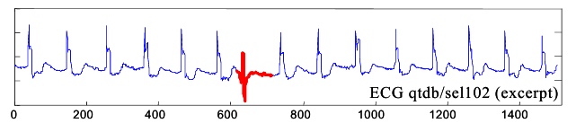
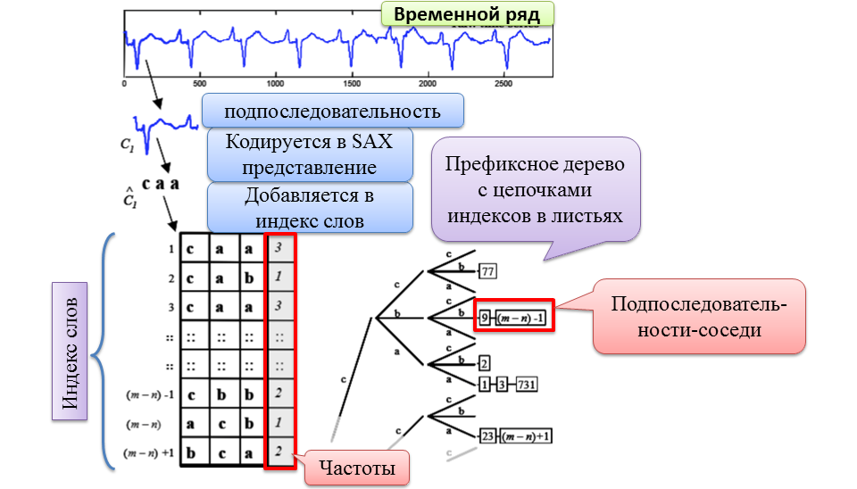

# Поиск диссонансов временного ряда

**Разработка параллельного алгоритма поиска диссонансов во временном ряде для многоядерных систем Intel Xeon Phi**

**Описание:** 
Временным рядом называется последовательность значений, описывающих проте-
кающий во времени процесс, измеренных в последовательные моменты времени, обычно
через равные промежутки. Временные ряды используются в самых различных областях
(техника, экономика, медицина, банковское дело и др. [1]) , и описывают различные процессы, протекающие во времени (ежедневные изменение цены на акции, курсы валют,
изменения объемов продаж, годового объема производства и др. [2]) . На данный момент хорошо изучена задача поиска тенденций, характерных для данного временного
ряда. Относительно новой и мало исследованной является задача обнаружения диссонансов временного ряда.

 

Один из подходов поиска аномалий временного ряда, предложенный Е. Кеохом (E.
Keogh) в 2005 году является поиск диссонансов (discords) [3] . Диссонансом временного
ряда называется подпоследовательность временного ряда, максимально сильно отлича-
ющаяся от остальных подпоследовательностей. Диссонансы временного ряда – самые
необычные подпоследовательности ряда. 

**Используемые технологии:** 
C++, OpenMP, icc compiler, OpenACC

**Полный перебор (Brute Force)**:

- Найти все попарные расстояния и максимум их минимумов
- Неприемлемо ввиду сложности 𝑂(𝑁^2)

**Наивный алгоритм на основе матрицы расстояний**

_***Реализация алгоритма.***_

Строится матрица расстояний всех подпоследовательностей временного ряда со всеми другими подпоследовательностями временного ряда.
Затем находятся минимумы расстояний в каждой из строк. Среди всех минимумов находится максимальное значение - это и будет диссонанс.

см. исходный код [здесь](src/parallel-distance-matrix/code)

см. модульные и функциональные тесты [здесь](src/parallel-distance-matrix/test)

_***Схема и псевдокод.***_

_***Модульная и файловая структура.***_

**Последовательный HOTSAX**:

Для ускорения поиска диссонанса используется упорядочивание итераций цикла с помощью двух вспомогательных структур данных: 
префиксное дерево с цепочками индексов начала подпоследовательностей и таблица слов со столбцом, содержащим количество вхождений слова. 
Находятся строковые аппроксимации всех подпоследовательностей, которые добавляются в индекс слов. 
По SAX представлениям строится префиксное дерево, в листья которого добавляются индексы начала подпоследовательностей.

 

**Параллельный HOTSAX алгоритм**

_***Реализация алгоритма для Intel Xeon Phi (OpenMP).***_

см. исходный код [здесь](src/parallel-hotsax/code)

см. модульные и функциональные тесты [здесь](src/parallel-hotsax/test)

_***Реализация алгоритма для GPU NVIDIA (OpenACC).***_

Реализация алгоритма для GPU NVIDIA использует технологию декларативного распараллеливания OpenACC
(используется версия 2 с компилятором PGI).

Возможны два варианта сборки проекта:
- из IDE Clion от JetBrains с использованием CMake (удобно, но официально не поддерживает компилятор PGI)
- из командной строки используя make-файл

см. исходный код [здесь](src/parallel-hotsax-openacc/code)

_***Схема и псевдокод.***_

_***Модульная и файловая структура.***_

**Литература**

1. Keogh E.J., et al. Finding the most unusual time series subsequence: algorithms and applications. Knowl. Inf. Syst. 2007. vol. 11, no. 1. pp. 1–27.
